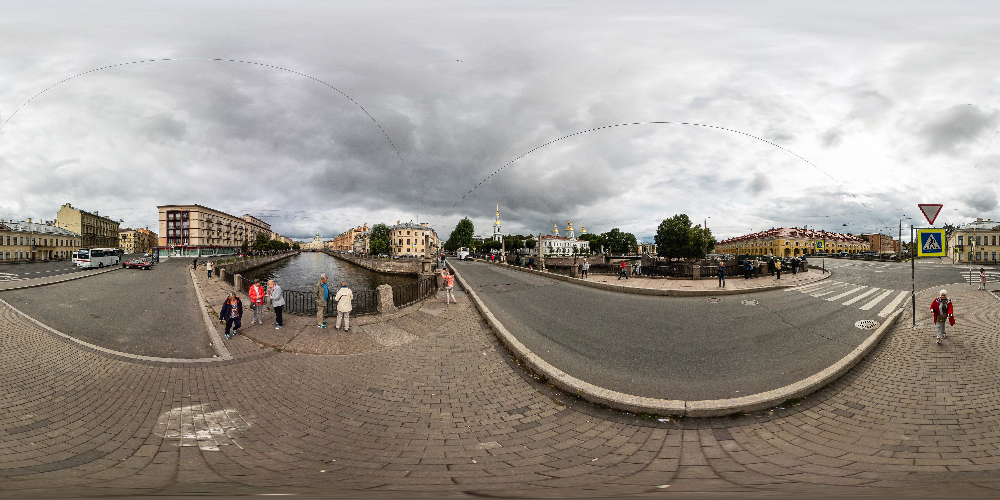

# Create Your Own Web Virtual Reality

<a href="https://github.com/MaksumRifai/360vr/blob/master/preview-360-1.png"></a>

# Virtual Reality
I used A-Frame, A-Frame Is A web framework for building virtual reality experiences, A-Frame handles the 3D and WebVR boilerplate required to get running across platforms including mobile, desktop, Vive, and Rift.

# 3D Model
You can download and use 3D models or object from anywhere or create your own with Blender. For this repo, I created my own Transjakarta Bus Model with MagicaVoxel, you can watch tutorial on my youtube channel here:

- [10 Menit Membuat Logo 3D (Digital Talent Scholarship)](https://www.youtube.com/watch?v=0GfNYFcDjMU&t=6s)
- [Membuat rumah dengan MagicaVoxel](https://www.youtube.com/watch?v=nbfeWj46R3c)
- [Tutorial Blender 3D Basic : View, Navigation, Transformation](https://www.youtube.com/watch?v=tEAuDC7SjsQ&t=33s)

<a href="https://behance.net/desainerhub"></a>

# Live and Preview
## Preview
<a href="https://github.com/MaksumRifai/360vr/blob/master/360vr-preview.gif"></a>
## Live
- https://maksumrifai.github.io/360vr/

Open Live Demo with Chrome Mobile Browser or AR/VR/XR Devices, note for Desktop Browser you need latest Chrome or Edge that suported and enabled for WebVR Experiences, Recommended use Mobile Browser for Best Experiences.

# How to use this template
## Clonning
Run the following command to clone this template to your local directory:
```
$ git clone https://github.com/MaksumRifai/360vr.git

```
## Download
Use green button above and click "Download Zip" or simply click [here](https://github.com/MaksumRifai/360vr/archive/master.zip)
## Customizing

```
<!DOCTYPE html>
<html>
  <head>
    <meta charset="utf-8">
    <title>Maksum Rifai - 3D 360 Virtual Reality Bus</title>
    <meta name="description" content="Panorama 360 Web VR - Maksum Rifai">
    <script src="https://aframe.io/releases/0.9.2/aframe.min.js"></script>
    <!--Aframe.js, not latest release, but latest compatible for Chrome Mobile Browser with minimal specs devices-->
  </head>
  <body>
    <a-scene stats>
      <!--Preparing assets Object 3D & 360 image-->
      <a-assets>
       <a-asset-item id="bus-obj" src="transjakarta.obj"></a-asset-item>
       <a-asset-item id="bus-mtl" src="transjakarta.mtl"></a-asset-item>
       
      </a-assets>
      <!--End of Preparing-->
      
      <!--Using Assets-->
      <!--Bus 1-->
      <a-entity rotation="0 204 0" scale="0.6 0.6 0.6" position="-2 0 -2" obj-model="obj: #bus-obj; mtl: #bus-mtl"></a-entity>
      <!--Bus 2-->
      <a-entity rotation="0 290 0" scale="0.6 0.6 0.6" position="10 0 1" obj-model="obj: #bus-obj; mtl: #bus-mtl"></a-entity>
      <!--Bus 3-->
      <a-entity rotation="0 110 0" scale="0.6 0.6 0.6" position="4.5 0 9" obj-model="obj: #bus-obj; mtl: #bus-mtl"></a-entity>
      <!--360 Degree Image-->
      <a-sky src="#image-360"></a-sky>
      <!--End of Using-->
      
      <!--Draw a simple Line for label only-->
      <a-entity line="start: -2 0 -2; end: 10 0 1; color: red"
          line__2="start: 10 0 1; end: 4.5 0 9; color: green"
          line__3="start: 4.5 0 9; end: -2 0 -2; color: blue"></a-entity>
      <!--Red: Bus 1 to 2, Green: 2 to 3, Blue: Bus 3 to 1-->
    </a-scene>
  </body>
</html>

```

In case you want to use your own models, simply replace the [.obj .mtl .png](https://en.m.wikipedia.org/wiki/Wavefront_.obj_file) files with yours. Don't forget to export your MagicaVoxel or Blender project properly.

For better and faster development you can use [Spck Code/Git Editor](http://play.google.com/store/apps/details?id=io.spck) for Android, I mainly use this Way.

<a href="https://github.com/MaksumRifai/360vr/blob/master/360vr.gif"></a>

<br/><br/>
# References & Resources

# A-Frame Boilerplate

Web framework for building virtual reality experiences.

[Github](https://github.com/aframevr/aframe) | [Website](https://aframe.io).

Alternatively, check out the [A-Frame Starter on
glitch.com](https://glitch.com/~aframe) for a more interactive way on getting
started.

# MagicaVoxel @ephtracy

A free lightweight GPU-based voxel art editor and interactive path tracing renderer.

[Github](https://github.com/ephtracy) | [Website](https://ephtracy.github.io/) | [Demo](https://youtu.be/mfKx4j-C6nI)

## Tutorial Videos

- [Youtube: Ephtracy](https://youtu.be/d_WymsNdRBA)
- [Youtube: Aaron Robbins](https://www.youtube.com/playlist?list=PLHtmobOgsDvlikllA1MBk7pk_DWlmtR_S)
- [Youtube: Maksum Rifai](https://www.youtube.com/watch?v=0GfNYFcDjMU&t=42s)

## Articles

- [Publishing Voxel Designs from MagicaVoxel to Sketchfab](https://blog.sketchfab.com/publishing-voxel-designs-from-magicavoxel-to-sketchfab/)
- [Building with MagicaVoxel and export to A-Frame (WebVR framework)](https://aframe.io/docs/0.3.0/guides/building-with-magicavoxel.html)
- [Script for animating MagicaVoxel rendering](http://drinkdecaf.com/magicavoxel_animate)

# Transjakarta and 360 Degree Image

## Copyright Notice & Disclaimer

All product TransJakarta and company/entity names are trademarks™ or registered® trademarks of their respective holders. Use of them does not imply any affiliation with or endorsement by them.
360 Degree Image from Flickr [hapePHOTOGRAPHIX](https://www.flickr.com/photos/hapephotographix/50878573691/in/pool-equirectangular/) for more Information, this image may copyrighted.

### Support Me
<a href="https://www.paypal.me/maksumrifai"></a>
<a href="https://invoice.xendit.co/donation/Dukungan"></a>
<a href="https://github.com/desainerhub"></a>
<a href="https://github.com/Bekasi-Dev-Community"></a>


